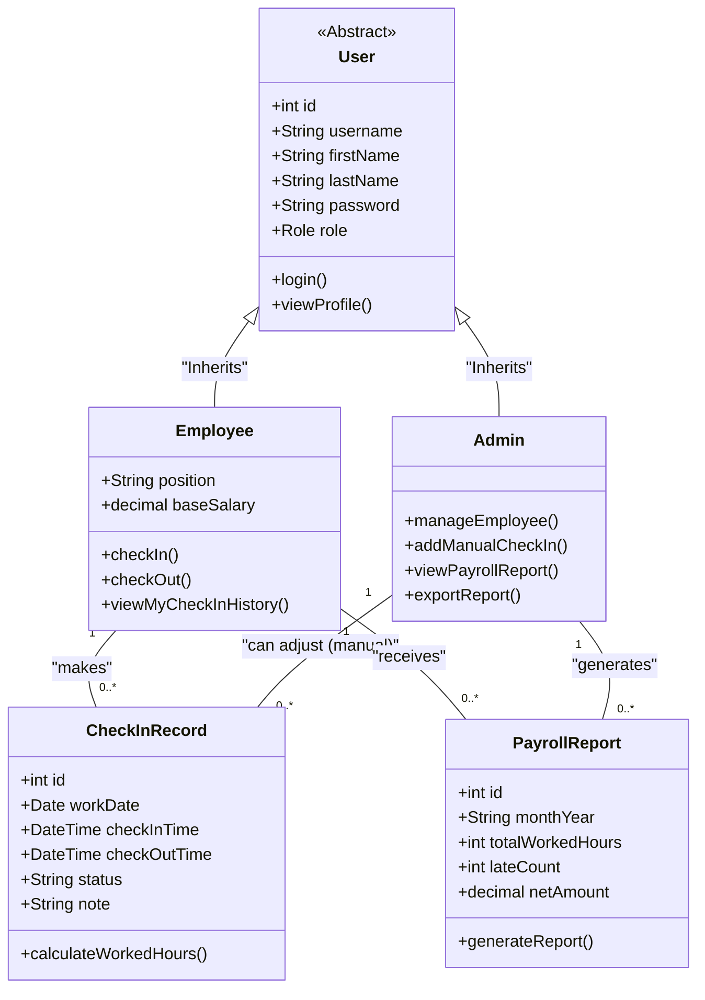

# Class Diagram ของระบบ (System Class Diagram)

เอกสารนี้แสดงโครงสร้างออบเจ็กต์/คลาสระดับแอปพลิเคชันหลักของ Employee Check-in 

---

### คำอธิบายโครงสร้างคลาส (Class Descriptions)

1. **User (Abstract)**
   - คลาสแม่สำหรับเก็บข้อมูลพื้นฐานของพนักงานในระบบ (username, password, name)

2. **Admin** (สืบทอดจาก User)
   - ผู้ดูแลระบบที่มีอำนาจในการจัดการบัญชีพนักงาน (`manageEmployee`), ปรับการลงเวลาในกรณ์ลืมลงเวลา (`addManualCheckIn`), และสร้างรายงานเงินเดือน 

3. **Employee** (สืบทอดจาก User)
   - พนักงานทั่วไป ทำหน้าที่หลักคือปุ่มกด `checkIn()` และ `checkOut()` พร้อมทั้งดูประวัติการเข้างานของตนเอง

4. **CheckInRecord**
   - ตัวแทนของการลงเวลาแต่ละวัน บันทึกเวลาเข้า-ออกอย่างชัดเจน

5. **PayrollReport**
   - คลาสสรุปข้อมูลที่รวมเข้าด้วยกันเพื่อออกยอดเงินเดือนปลายงวด
