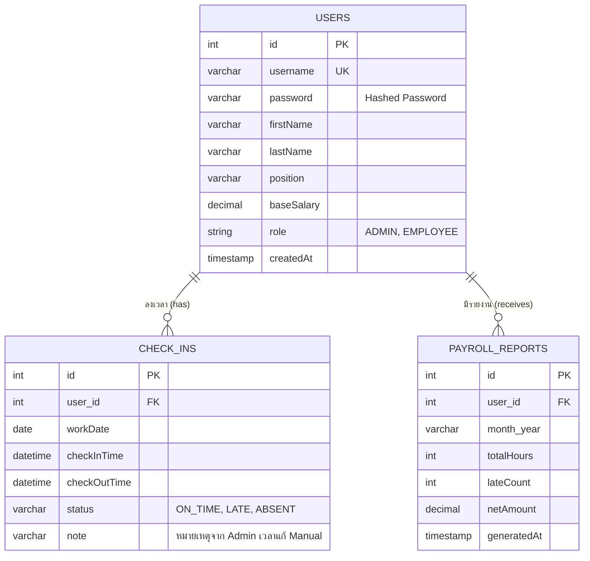

# ER Diagram ของระบบ (Entity-Relationship Diagram)

แผนภาพความสัมพันธ์ (ER Diagram) ของตารางข้อมูลหลักที่ใช้งานในระบบ Check-in

### คำอธิบายโครงสร้างตารางหลัก:
1. **USERS**: จัดเก็บข้อมูลพนักงาน ไม่ว่าจะเป็นระดับผู้ดูแล (Admin) หรือพนักงานทั่วไป (Employee) 
2. **CHECK_INS**: จัดเก็บรายการลงเวลาทำงานแต่ละวัน (`checkInTime` และ `checkOutTime`) พร้อมสถานะการเข้างาน
3. **PAYROLL_REPORTS**: จัดเก็บข้อมูลสรุปรายงานเงินเดือนประจำเดือน ที่ประมวลผลมาจากตาราง CHECK_INS
