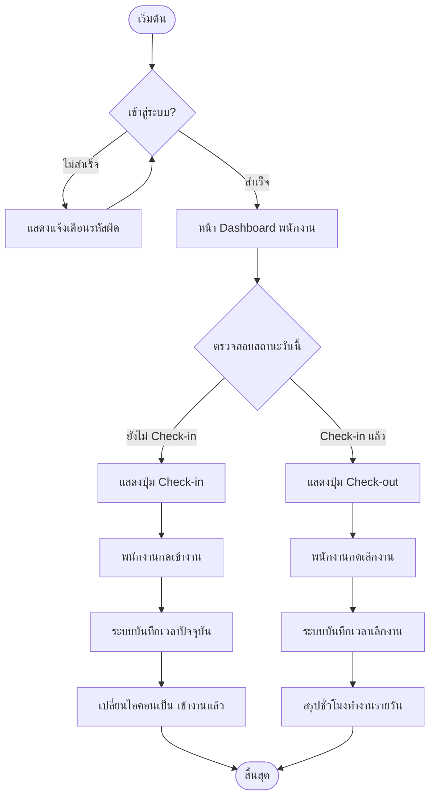
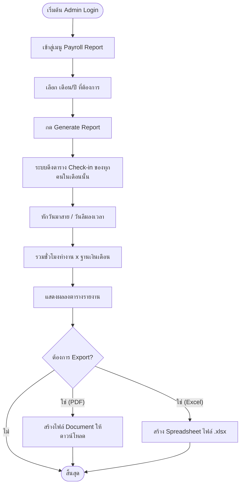

# แผนผังการทำงาน (Flowchart)

เอกสารแสดงลำดับขั้นตอนการทำงาน (Workflow) หลักในระบบผ่านผังงาน (Flowchart)

---

## 1. Flowchart ระบบลงเวลา (Check-in / Check-out)

แสดงขั้นตอนตั้งแต่พนักงานทำการล็อกอิน จนไปถึงการประทับเวลา

---

## 2. Flowchart การจัดการรายงาน (Admin Payroll Flow)

แสดงขั้นตอนฝั่งหัวหน้างาน/HR ในการออกรายงานสรุปเงินเดือน

