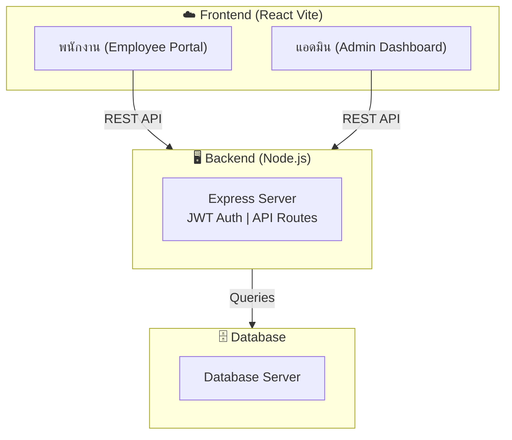

# บทนำและภาพรวมโครงการ
## ระบบ Employee Check-in & Payroll System

**ชื่อโครงการ:** Check_inPJ  

---

## 1. วัตถุประสงค์ของโครงการ
1. **พัฒนาระบบลงเวลาทำงาน** ผ่านเว็บแอปพลิเคชันที่ใช้งานง่าย
2. **พัฒนาระบบ Admin Dashboard** เพื่อให้ HR และผู้บริหารจัดการข้อมูลพนักงานได้
3. **คำนวณเงินเดือนอัตโนมัติ** ตัดปัญหาการคิดชั่วโมงการทำงานด้วยมือ
4. **รวมศูนย์ข้อมูล** ช่วยให้ตรวจสอบเวลาและประวัติพนักงานได้ครบถ้วนในที่เดียว

---

## 2. ขอบเขตของโครงการ

### 2.1 สิ่งที่อยู่ในขอบเขต (In Scope)

| หมวด | รายละเอียด |
| :--- | :--- |
| **ระบบพนักงาน** | เข้าสู่ระบบ, ลงเวลาเข้า-ออกงาน, ดูประวัติการลงเวลาส่วนตัว, แก้ไขโปรไฟล์ |
| **ระบบ Admin** | จัดการผู้ใช้งาน (CRUD พนักงาน), ลงเวลาแทนพนักงาน (Manual Check-in) |
| **รายงาน** | การออกรายงานเงินเดือน (Payroll Report), สรุปการทำงานรายบุคคล |
| **ความปลอดภัย** | JWT Authentication, Role-based Access (Admin / Employee) |

### 2.2 สิ่งที่ไม่อยู่ในขอบเขต (Out of Scope)
- แอปพลิเคชันมือถือแบบ Native (iOS/Android)
- ระบบเชื่อมต่อกับเครื่องสแกนลายนิ้วมือโดยตรง (เป็น Web check-in แมนวล)

---

## 3. ภาพรวมระบบ (System Overview)

### 3.1 สถาปัตยกรรมระบบ
ระบบเป็น **Full-Stack Web Application**

### 3.2 ผู้ใช้งานของระบบ
| กลุ่มผู้ใช้ | ช่องทางการเข้าถึง | สิทธิ์การทำงาน |
| :--- | :--- | :--- |
| **พนักงาน (Employee)** | Web Browser | เข้าสู่ระบบ, ลงเวลา, ตรวจสอบเวลาทำงานตนเอง |
| **ผู้ดูแลระบบ (Admin)** | Web Browser | ทุกสิทธิ์ของพนักงาน + จัดการพนักงาน + ออกรายงาน |

---

## 4. เทคโนโลยีที่ใช้พัฒนา

| ชั้นระบบ | เทคโนโลยี |
| :--- | :--- |
| **Frontend Framework** | React.js (Vite) |
| **Styling** | Tailwind CSS / CSS3 |
| **Backend** | Node.js + Express |
| **Database** | MySQL / MongoDB (ขึ้นกับ Config) |
| **Auth** | JSON Web Token (JWT) |

---

## 5. ตัวชี้วัดความสำเร็จของโครงการ (Project Success Metrics)

เพื่อให้โครงการบรรลุตามวัตถุประสงค์ที่ตั้งไว้ นี่คือตัวชี้วัดความสำเร็จหลัก (KPIs) ของโครงการ:

| ด้าน (Perspective) | ตัวชี้วัด (Indicator) | เป้าหมาย (Target) |
| :--- | :--- | :--- |
| **ประสิทธิภาพ (Efficiency)** | ระยะเวลาที่ HR ใช้ในการสรุปข้อมูลการลงเวลารายเดือน | ลดลงอย่างน้อย 80% เทียบกับระบบแมนนวล |
| **ความแม่นยำ (Accuracy)** | ข้อผิดพลาดจากการบันทึกและการคำนวณเงินเดือน (Human Error) | 0% (มีความแม่นยำ 100%) |
| **การยอมรับระบบ (Adoption)** | อัตราส่วนพนักงานที่เปลี่ยนมาใช้งานระบบลงเวลาใหม่ | 100% ของจำนวนพนักงานทั้งหมด |
| **ความพึงพอใจ (Satisfaction)** | คะแนนความพึงพอใจต่อความง่ายและสะดวกในการใช้งาน | คะแนนเฉลี่ย 4/5 เป็นต้นไป |
| **ความเสถียร (System Uptime)** | ความพร้อมใช้งานของระบบในช่วงเวลาทำการปกติ | ไม่ต่ำกว่า 99.9% |

---

## 6. ความสำเร็จของโครงการ (Project Achievements)

โครงการนี้ได้พัฒนาและทดสอบจนสมบูรณ์ครอบคลุมฟีเจอร์ดังต่อไปนี้:

| ✅ ฟีเจอร์ที่สำเร็จ | รายละเอียด |
| :--- | :--- |
| **หน้าพนักงาน (Employee Portal)** | ลงเวลาเข้า-ออกงาน (Check-in/Checkout), ติดตามประวัติการลงเวลา, จัดการโปรไฟล์ส่วนตัว |
| **ระบบ Admin Dashboard** | ดูภาพรวมการทำงานรายวัน, จัดการข้อมูลพนักงาน (CRUD), บันทึกเวลาเข้า-ออกด้วยตนเอง (Manual Check-in) |
| **คำนวณเงินเดือนอัตโนมัติ** | คิดชั่วโมงการทำงานและแสดงข้อมูลคำนวณเงินเดือนเบื้องต้น ลดภาระการคำนวณด้วยตนเองแบบแมนนวลให้ HR |
| **JWT Authentication** | ระบบรักษาความปลอดภัยในการ Login, การจัดการ Session, Role-based Access อย่างชัดเจน (Employee/Admin) |
| **ระบบรายงานการทำงาน (Reports)** | ความสามารถในการออกรายงาน (Export/View) ประวัติเวลาเข้าการทำงานสถิติต่างๆ สำหรับพนักงานและแอดมิน |
| **Responsive Design** | UI ออกแบบให้รองรับและใช้งานสะดวกจากทั้งบน Desktop และในหน้าจอโทรศัพท์มือถือ |
| **Deploy Production Setup** | โครงสร้างโปรเจคเตรียมพร้อมสําหรับการ Deploy ขึ้นระบบ Production ทั้งส่วน Frontend และ Backend |

---

## 7. เอกสารที่เกี่ยวข้อง

| เอกสาร | คำอธิบาย |
| :--- | :--- |
| [SRS.md](./SRS.md) | ความต้องการของระบบ (Software Requirements Specification) |
| [ER_Diagram.md](./ER_Diagram.md) | แผนภาพความสัมพันธ์ฐานข้อมูล |
| [Class_Diagram.md](./Class Diagram.md) | ภาพรวมคลาสภายในระบบ |
| [Data_Dictionary.md](./Data_Dictionary.md) | พจนานุกรมข้อมูลตารางและคอลัมน์ |
| [Master_Data.md](./Master_Data.md) | ข้อมูลคงที่และตั้งค่าพื้นฐานของระบบ |
